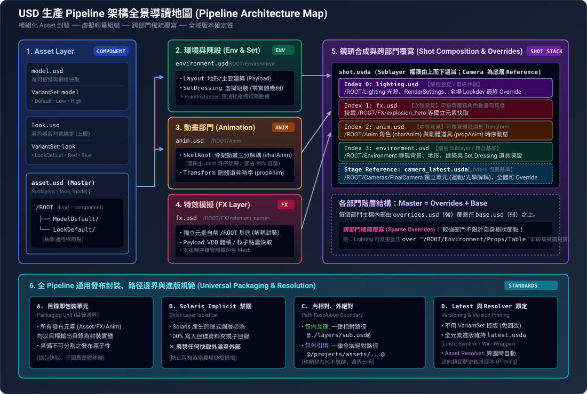

# USD：架構設計體系總覽與導讀 (Map of Content)

本目錄匯集了影視與動畫工業級 **OpenUSD 生產 Pipeline 架構設計** 的完整規範。從底層 Asset、場景陳設（Set Dressing）、角色動態（Animation）、特效模擬（FX），到鏡頭圖層堆疊（Shot Layers）、跨部門覆寫（Overrides）、發布封裝（Packaging）與進版鎖定（Versioning & Resolver），建立了一套高內聚、低耦合、極致輕量且具備歷史可重現性的 USD 體系。

---

## 🗺️ 架構全景導讀地圖 (Pipeline Architecture Map)

---

## 📚 專題筆記清單與核心權威索引

全套架構由 11 篇互補且深度的專題筆記構成，涵蓋 Pipeline 所有核心面向：

| 筆記名稱 | 核心探討範疇 | 關鍵架構概念 |
| :--- | :--- | :--- |
| **[USD Shot Layers 鏡頭分層與覆寫架構](docs/usd-shot-layers.md)** | 鏡頭總成、強弱權重、覆寫機制與渲染設定 | 四大部門圖層順序（`L > FX > A > E`）、`Master = Overrides + Base`、跨部門稀疏覆寫、`/Render` 命名空間 |
| **[USD Asset Layer 架構設計](docs/usd-asset-layer.md)** | 單一發布 Asset 內部結構 | 模型/材質雙包 Reference 嫁接、`ModelDefault`/`Look`、雙維度 VariantSet、`/ROOT` 解耦哲學 |
| **[USD Environment 與 Set Dressing 場景陳設架構設計](docs/usd-environment-setdressing.md)** | 世界舞台與場景陳設組裝 | Layout 與 Set Dressing 組合、虛擬組裝（零幾何實體）、`PointInstancer` 點雲數據消耗 |
| **[USD Animation Layer 動態架構設計](docs/usd-animation-layer.md)** | 角色骨架與道具時序動態 | 角色拆為幾何材質與綁定兩個發布單元、`SkelRoot` 底下三分支（`Geometry` + `Skel` + `AnimData`）、數 MB 極致輕量儲存 |
| **[USD FX Layer 鏡頭特效層架構設計](docs/usd-fx-layer.md)** | 特效元素封裝與掛載機制 | `/ROOT/FX/<element_name>`、元素自身以 `/ROOT` 為基底、Payload 延遲載入體積與點雲 |
| **[USD Lighting Layer 燈光層架構與最終仲裁權](docs/usd-lighting-layer.md)** | 最強層的權限行使、光源連結與跨鏡頭複用 | 能在上游修正者一律退回上游、`lightLink` / `shadowLink` 以排除而非列舉、Light Rig 發布為 Pure USD 單元 |
| **[USD 發布封裝、路徑邊界與進版解析架構](docs/usd-publish-packaging.md)** | 通用封裝、路徑邊界與版本控制 | 目錄即包裝單元、內相對外絕對、`latest` 指向與 Asset Resolver 逆向鎖定 |
| **[USD Asset Loader 工具架構設計](docs/usd-asset-loader.md)** | 全元素載入與場景陳設工具架構 | Query/Load 兩段式分離、原生 Composition Arcs、自由指定 Prim Path、Instanceable、Class Inherits 標籤廣播 |
| **[USD Solaris Implicit Layer 治理與輸出指南](docs/usd-solaris-implicit-layer.md)** | Solaris 導出虛擬層收斂與治理機制 | Flatten 打平優先、無法打平時強制落地子目錄（`./layers/`）、`Configure Layer` 主動顯式化（Explicit Layer） |
| **[USD Skel 骨架動畫設定指南](docs/usd-skel-guide.md)** | Skel Schema 底層語法與陣列規範 | `SkelRoot` 邊界、`bindTransforms` 與 `restTransforms` 的座標空間差異、`elementSize` 踩雷點 |
| **[USD Pipeline 驗證與 QC 架構](docs/usd-pipeline-validation.md)** | 規範的強制執行機制 | 索引而非規則本體、三級嚴重度（攔阻／報告／建議）、三道關卡、具名具時限之豁免機制 |

---

## 🏛️ 全 Pipeline 貫穿的九大架構共通鐵律

本目錄下所有專題設計，均無一例外地嚴格遵守以下九大基礎鐵律：

### 1. 統一根節點 `/ROOT`、語意命名解耦，且結構性意見為 Pipeline 工程專有
- **所有發布單元（Asset、Set Dressing、FX Element、Shot）頂層一律以 `/ROOT` 為唯一根節點**；總裝層與各 sub 物件包一致採用 `/ROOT`，不另立命名，使工具鏈得以無條件鎖定。
- **唯一例外：鏡頭的渲染設定置於 `/Render`**（`/ROOT` 的同層兄弟）。渲染設定不是場景內容，不應隨場景被引用；且渲染器透過 `renderSettingsPrimPath` 或型別遍歷定位它，與路徑無關。此結構亦與 Houdini Solaris 原生行為一致。
- **解耦哲學**：Asset 內部不硬編碼特定名稱（如 `/Chair`），而是在被引用端（Consumer）消費時，由外部 Stage 自由指派語意路徑（如 `/ROOT/Environment/Props/OfficeChair_01`）。
- **Sub 物件以 Reference 嫁接**：`modelDefault/`、`lookDefault/` 等 sub 物件包各為自成一體的封裝單元，由 Pipeline 在總裝層以 `references` 嫁接至 `/ROOT`；清單順序即意見強弱。
- **結構性宣告由 Pipeline 獨佔**：`kind`、`variantSets` 與嫁接決策一律僅由總裝層宣告，sub 物件包**嚴禁出現**。部門在 `/ROOT` 的白名單**僅含 `collection`**（單元對自身內容的自述）。
- **`xformOp` 一律嚴禁**：發布單元的根若帶 transform，消費端擺放時會疊加成雙重變換；根必須恆為 identity。角色的 `SkelRoot` 為唯一型別例外。

### 2. Sublayer 強弱順序與意見貫穿（LIVRPS / Layer Stacking）
- 鏡頭頂層 `subLayers` 順序決定意見權重（Index 越小意見越強）：
  `Lighting (0, 最強) > FX (1, 次強) > Animation (2, 中等) > Environment (3, 最弱)`
- 頂層具備最高仲裁權，可在不觸碰下層快取的前提下，達成非破壞性微調（Non-destructive Overrides）。

### 3. 部門內部階層化與跨部門稀疏覆寫（Sparse Overrides）
- 每個主要圖層內部皆為 `Master = Overrides + Base` 結構；`overrides.usd` 本身作為容器 Sublayer 多個任務覆寫小檔。
- **打破自身 Scene Tree 限制**：較強部門可直接在 override 圖層宣告 `over "/ROOT/..."`，跨部門覆寫較弱部門的屬性（如 Lighting 修改環境道具 Shader、FX 設定動畫角色可見度）。

### 4. 虛擬組裝與資料徹底解耦（極致輕量化）
- **Set Dressing**：100% 透過 Reference / Payload 引用 Component Asset，無多邊形實體，容量僅數 KB 至數 MB（唯一的磁碟體積為 `PointInstancer` 座標陣列）。
- **Animation**：幾何早已在 Asset 階段發佈；動畫層僅存數十個 Joint 旋轉四元數與 Matrix TimeSamples，免除傳統全頂點烘焙動輒數十 GB 的肥大快取。

### 5. 目錄級封裝邊界、同構結構與路徑雙重標準
- **全元素通用**：Asset、Set Dressing、Animation、FX、Pure USD 一體適用。
- **目錄即包裝單元與同構內部結構**：以目標資料夾底下的全體檔案作為不可分割的單一發布單元。無論任何具體物件，資料夾內部結構與命名固定同構（如 `asset_latest.usda`、`modelDefault/`、`lookDefault/`），絕不以 Asset 名稱命名內部檔案。
- **發布根目錄分類**：發布樹由**作用域層級**（專案／序列／鏡頭）與**分類容器**兩條正交的軸構成。同一種分類可出現在不同作用域，語意相同而可見範圍不同（`assets/fx/` 為跨鏡頭重複取用的元素，`shots/<seq>/<shot>/fx/` 為該鏡頭專屬的模擬產出）；`libraries/`（Pure USD，不套結構檢查）在專案、序列、鏡頭三層各自獨立存在，其位置即宣告該單元的作用域。三條不變量：任一目錄不得兼任分類目錄與包裝單元、單元名於其作用域層級內唯一（工具鍵為「作用域路徑＋單元名」）、**目錄樹不鏡射場景樹**（跨分類連接一律以 Reference 明示，不以目錄巢狀或命名巧合暗示）。分類層數與命名形式則由專案自訂。
- **暫存輸出與原子移轉註冊（Staging & Atomic Promotion）**：所有發布一律先輸出至隔離的暫存資料夾，待流程完全跑完且驗證通過後，才原子移轉至專案正式流程目錄並完成註冊，杜絕半成品外溢污染。
- **Solaris Implicit Layer 治理與子目錄收斂**：優先採用 Flatten 打平；無法打平時由 Houdini 自動轉換輸出之圖層，必須透過 `Save Paths Relative to Output` 強制限制在輸出子目錄（如 `./layers/`）內，嚴禁外溢。亦可透過 `Configure Layer` 主動將隱式圖層顯式化。詳情參閱 [USD Solaris Implicit Layer 治理與輸出指南](docs/usd-solaris-implicit-layer.md)。
- **路徑邊界與 Expression Variable 替換**：
  - **包內互連**：一律使用相對路徑 `@./...@`，確保發布目錄可隨意搬遷、封存、跨平臺掛載而不壞鏈。
  - **包外引用**：輸出時由 Solaris Output Processor 自動將專案前綴替換為 Stage Expression Variable（``@`"${PROJECT_ROOT}/..."`@``），並於 Layer Metadata 預設宣告；專案遷移或交接客戶時，只需在頂層重新指派變數即可一口氣全局生效。

### 6. `asset_latest` 動態指向與 Asset Resolver 逆向鎖定（Version Pinning）
- **版本控管的架構取捨**：不採用 VariantSet 控版（避免回溯修改歷史註冊檔），改採目錄進版（`v001`, `v002`...）並自動維護 `asset_latest.usda`。歷史版本在**位元組層級**凍結；**合成結果**則因跨包引用 `latest` 而會漂移，此為「日常漂移、關鍵時刻鎖定」的刻意設計，確定性由 Resolver 承擔。
- **Sub 物件無 latest 與推進連動**：Asset 底下的 `modelDefault/`、`lookDefault/` 等 sub 物件自身不設 `latest`；每次子組件進版，直接驅動單元物件 Asset 整體進版，並由 Pipeline 自動更新根目錄唯一的 `asset_latest.usda`。
- **跨平臺適配**：全平臺統一採用 `subLayers = [@./v###/asset.usd@]` 包裝圖層，不使用 Symlink——共用儲存上只存在單一檔案，且唯有真實 Layer 才能被 Asset Resolver 攔截。包裝圖層必須完整複製版本層的 Layer Metadata，否則 `upAxis` 等設定將回落至預設值；且一律以 **`.usda` 明文格式**寫出——版本層是位元組凍結的內容，包裝圖層是每次進版都被重寫的指標，兩者性質不同，明文讓 Metadata 複製一眼可驗。
- **歷史確定性**：日常製作預設引用 `asset_latest.usda` 享受無感更新；提交渲染與發布時，由自訂 **Asset Resolver** 於 `Resolve()` 攔截並重寫路徑，將 `asset_latest` 逆向鎖定為具體歷史版本。情境以 `ArResolverContext` 攜帶；鎖定清單須**遞移涵蓋整棵依賴樹**，且鎖定情境下找不到清單必須 fail loud。此機制保證的是 **USD 組合結果的確定性**，畫面完全重現尚須貼圖、快取與渲染器版本各自的封存策略。

### 7. Stage Metadata 全專案一致：USD 不做任何自動轉換
- **三項必須統一並於每個發布單元入口層宣告**：`metersPerUnit`、`upAxis`、`timeCodesPerSecond`。
- **最反直覺之處**：Asset 被 Reference / Payload 引入時，**被引用層的宣告會被完全忽略**，Stage 只採用 root layer 的值。USD **不會**依差異縮放幾何、**也不會**旋轉座標系——這兩項是「宣告」而非「轉換指令」。以公尺建模的角色引入公分制專案，會靜默地變成 1.8 公分高。
- **本架構採公尺 + Y-up**（`metersPerUnit = 1`、`upAxis = "Y"`），與 Houdini 原生行為一致；公分制專案等同持續與 Houdini 的求解器尺度假設與 Camera 換算對抗。
- **fallback 隨環境而異，漏宣告的後果不可預測**：標準 OpenUSD 的 `upAxis` fallback 為 `"Z"`，而 Houdini 覆寫為 `"Y"`（實測 22.0）；`metersPerUnit` 的 fallback 兩者皆為 `0.01`，與本架構的公尺制相反。未宣告的圖層在 Houdini 中看似正常，送進標準環境即躺倒或縮小百分之一。
- **Camera 焦距的單位恆為 scene unit 的十分之一**，與採用何種單位制無關；變的是 scene unit 本身——公分制下十分之一即 1mm（`focalLength = 35` 就是 35mm），公尺制下則為 10cm（35mm 須寫作 `0.35`）。誤填 `35` 時 FOV 仍正確（比值不變），但**景深徹底錯亂**，會拖到 Lighting 階段才爆。
- **`timeCodesPerSecond` 不一致會引發隱式時間縮放**：sublayer 與 root layer 數值不同時，USD 依比值自動縮放時間樣本，動畫不報錯、不壞掉，僅整體速率偏移——極難歸因。
- **發布時須確保幾何數值本身即符合專案單位**，不得倚賴 metadata 宣告來救。詳見：[USD 發布封裝、路徑邊界與進版解析架構](docs/usd-publish-packaging.md)。

### 8. 材質綁定契約：幾何零材質、零綁定
- **幾何發布單元一律不得攜帶材質**：`modelDefault/`、FX `layers/` 等幾何包內，**嚴禁出現任何 `Material` / `Shader` Prim，亦嚴禁宣告任何 `material:binding`**（含 `GeomSubset` 上的分面綁定）；外觀 100% 交由 look / material 圖層全權決定。
- **為什麼是鐵律**：依 OpenUSD 規則，後代 Prim 的 direct binding 恆強於祖先的繼承意見，且**與圖層強弱完全無關**。幾何只要夾帶了 direct binding，上游無論站在多強的圖層，其覆寫都會**靜默失效**——此即多數 Pipeline「材質覆寫寫了卻沒反應」的根因。
- **維持零綁定後的自然秩序**：覆寫能力回歸 LIVRPS，形成「鏡頭覆寫（Local）> 類別廣播（Inherits）> Asset 預設（References）」的正確優先序，無需任何額外機制。
- **綁定由材質包以 `over` 寫入幾何分支**：`GeomSubset` 分面綁定只能寫在各 subset 上，多材質情形非 `over` 不可，故單材質亦走同一條路。`/ROOT` 上不承載任何屬性。
- **下游覆寫由覆寫者依意圖選擇形狀**：整顆換材質用 collection binding（`strongerThanDescendants`）寫在實例根、不需內部知識；局部或分面則往下 `over`。唯一的不變量是**覆寫深度不得淺於既有綁定**，否則靜默落敗。
- **由發布 Hook 強制剝除**：DCC 匯出器預設就會在 Mesh 上寫入 direct binding，故必須於輸出時主動移除，QC 僅為最後把關。詳見：[USD Asset Layer 架構設計](docs/usd-asset-layer.md)。

### 9. Purpose 對稱完整性、ModelAPI DrawMode 與 `usdkind` 治理
- **Purpose 兩者齊備原則**：幾何若定義 `purpose`，`render` 與 `proxy` 必須兩者齊全；無 Proxy 代理網格則一律保持為 `default`，防止 Viewport 與農場渲染顯示不同步。
- **Viewport 降載首選 ModelAPI DrawMode**：`purpose` 為全域性切換，而 **USD ModelAPI 的 `drawMode`**（`bounds`, `cards`）可針對個別 Component 或 Assembly 獨立降級顯示，是釋放 Viewport 與顯存壓力的最核心手段。
- **Pipeline 嚴格維護 `usdkind`**：ModelAPI 的階層選取與 DrawMode 機制 100% 依賴 `kind` 元數據（`component`, `group`, `assembly`）。Pipeline 所有輸出與驗證工具必須在任何時候全力維護 `kind` 規則，確保 ModelAPI 能力正常運作。詳見：[USD Asset Layer 架構設計](docs/usd-asset-layer.md)。

---

## 👥 部門協同與閱讀導引

各專業崗位可依下列推薦順序研讀本體系筆記：

| 專業崗位 | 核心推薦閱讀篇目 | 實踐重點 |
| :--- | :--- | :--- |
| **Pipeline / TD / 架構師** | 全部 11 篇（著重於 [USD 發布封裝、路徑邊界與進版解析架構](docs/usd-publish-packaging.md)、[USD Asset Loader 工具架構設計](docs/usd-asset-loader.md)、[USD Solaris Implicit Layer 治理與輸出指南](docs/usd-solaris-implicit-layer.md)、[USD Shot Layers 鏡頭分層與覆寫架構](docs/usd-shot-layers.md)） | 掌握包裝邊界驗證、Solaris ROP 配置、Implicit Layer 輸出治理、Asset Resolver 鎖定邏輯、發布 Hook 與 QC 規則模組實作。 |
| **Model / Lookdev TD** | [USD Asset Layer 架構設計](docs/usd-asset-layer.md)、[USD 發布封裝、路徑邊界與進版解析架構](docs/usd-publish-packaging.md) | 理解幾何與材質雙層解耦、Model/Look VariantSet 封裝、以及 `/ROOT` 命名規範。 |
| **Layout / Set Dresser** | [USD Asset Loader 工具架構設計](docs/usd-asset-loader.md)、[USD Environment 與 Set Dressing 場景陳設架構設計](docs/usd-environment-setdressing.md)、[USD Solaris Implicit Layer 治理與輸出指南](docs/usd-solaris-implicit-layer.md)、[USD Asset Layer 架構設計](docs/usd-asset-layer.md) | 掌握 Loader Query/Load 擺放實務、Assembly 虛擬組裝、跨鏡頭 Set Asset 複用、`PointInstancer` 海量散佈優化、與避免 multi-input 產生外溢隱式圖層。 |
| **Animator / Rigging TD** | [USD Animation Layer 動態架構設計](docs/usd-animation-layer.md)、[USD Skel 骨架動畫設定指南](docs/usd-skel-guide.md) | 掌握角色雙單元切分（`asset` / `char`）與 `SkelRoot` 三分支，蒙皮權重歸骨架包以 `over` 注入，避免輸出全幾何快取。 |
| **FX Artist / TD** | [USD FX Layer 鏡頭特效層架構設計](docs/usd-fx-layer.md)、[USD Shot Layers 鏡頭分層與覆寫架構](docs/usd-shot-layers.md) | 掌握 `/ROOT/FX/<element_name>` 註冊名掛載、獨立元素自帶 `/ROOT`、以及角色隱藏接管機制。 |
| **Lighting / Render TD** | [USD Lighting Layer 燈光層架構與最終仲裁權](docs/usd-lighting-layer.md)、[USD Shot Layers 鏡頭分層與覆寫架構](docs/usd-shot-layers.md)、[USD 發布封裝、路徑邊界與進版解析架構](docs/usd-publish-packaging.md) | 掌握最強層的節制原則、`lightLink` / `shadowLink` 連結機制、Light Rig 跨鏡頭複用、`/Render` 命名空間與算圖版本鎖定（Pinning）。 |

---

## 🛠️ Pipeline 工具與參考實作庫

本專案不僅提供理論架構，亦提供工業級的實作工具腳本，供工作室直接引入或作為開發基準：

- **[Houdini Solaris Output Processors 工具庫](tools/outputprocessors/README.md)**：
  - **`portablereferences.py`**：自動辨識 Package Root 邊界，將包內向上跳層（`@../modelDefault/...@`）及子目錄參照改寫為相對路徑，並寫入發布追蹤後設資料。
  - **`projectrootvariable.py`**：將全域專案目錄絕對路徑動態改寫為 USD Stage Expression Variable（`` `"${PROJECT_ROOT}/..."` ``），支援一鍵全局遷移。
  - 附帶完整純 Python 自動化單元測試。
- **[Houdini Solaris Layer Inspector 檢測工具庫](tools/layerinspector/README.md)**：
  - **`layer_inspector.py`**：輸出前置檢查 Stage 圖層狀態，辨識隱式（Implicit）與顯式（Explicit）圖層、反查建立圖層的肇因 LOP 節點，並檢測無效 Sublayer 壞鏈。
  - 支援 Python Shell 終端排版報告（`print_summary()`）與 JSON 格式輸出。
- **[角色動畫靜態／時序拆分工具](tools/charsplitter/README.md)**：
  - **`char_splitter.py`**：將合成後的角色 Stage 拆為 `skel`（`Skeleton`、`BlendShape` 本體、蒙皮綁定）與 `anim`（`SkelAnimation` 時序）兩個 sub 單元，並處理綁定的命名空間繼承、`skel:joints` 重映射、非預設 `skinningMethod` 等會靜默出錯的環節。
  - 僅依賴 `pxr`，不綁定任何 DCC；附含重新合成驗證的單元測試。

